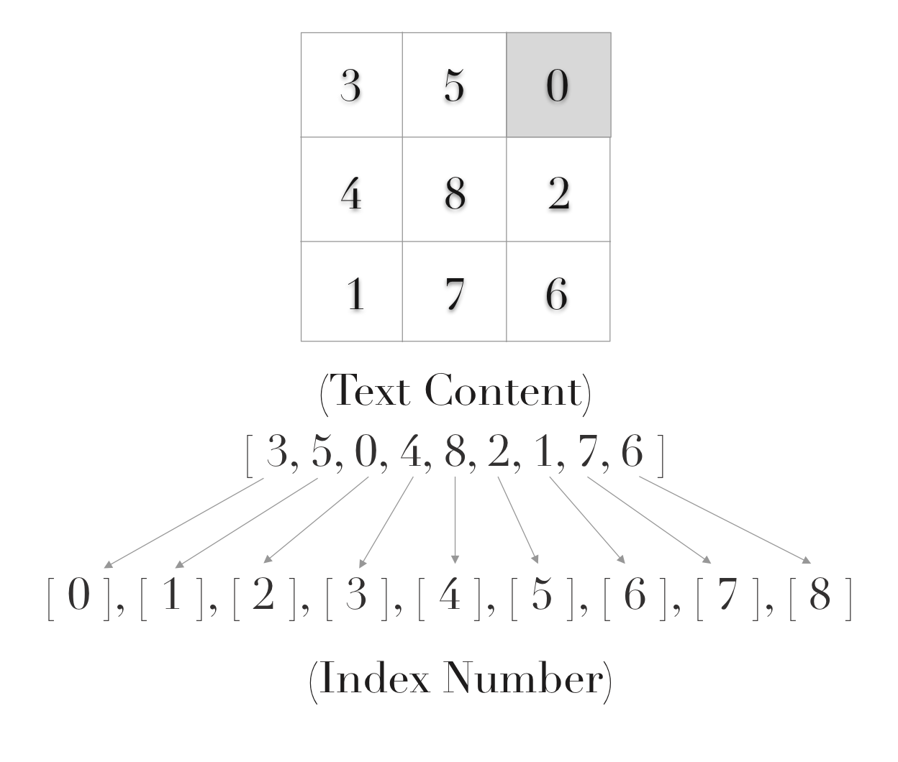

# General Assembly WDI Project 1: Sliding Puzzles

> Project 1 of 4 during my Web Development Immersive course at General Assembly

Link to [GitHub Repo](https://github.com/indiaderrick/wdi-project-one/tree/gh-pages)

[Play Sliding Puzzles](https://indiaderrick.github.io/wdi-project-one/)

### Brief

To create a single-page grid-based game, using HTML, CSS, and JavaScript technologies learnt in the first three weeks of the course.

## Concept

This was my first ever JavaScript project so I chose to make a simple game - sliding puzzles. When the player clicks to start, the pieces of the puzzle are randomised and the aim of the game is to recreate the original picture. Only puzzle pieces above/below or to the left/right of the black box can be moved - when clicked, they will slide to fill the space of the black box and therefore swap positions. Once all of the pieces are in the right place, the final piece of the puzzle automatically appears to complete it.

## Technologies Used

| Category | List |
| ---- | --- |
| Languages                            | Javascript (ECMAScript6), CSS3, HTML5 |
| Typefaces                            | Google Fonts |
| Sounds                               | Sound Bible |
| Text Editor                          | Atom |
| Browser                              | Chrome |
| Version control | Git and GitHub


## What to Expect
> The game includes:

  - Personalisation whereby you enter your name on the landing page and the instructions are then dictated to you using a typewriter effect.
  - Players click counts are recorded and displayed on win.
  - Lots of sound effects which get very annoying after a very short amount of time.
  - Ability to view the original image as an aid during play.
  - Reset or reshuffle.

## Final Product

### Homepage

<p align="center">
  
</p>

### Instructions

<p align="center">
  
</p>

### In Play

<p align="center">
  
</p>

### Winning Screen

<p align="center">
  
</p>


## Some Logic

Each piece of the puzzle was represented by its text content (hidden) as a number from 0 to 8. At the start when all the pieces are in order, this is reflective of their position in the array, i.e the piece with the text content 3 was also at index [3] in the array. When the pieces are shuffled at the start of play, these no longer match and it is only when they match up again that the player wins.

 The piece with the text content of 0 was the black box. This would swap with whichever piece of the puzzle the user clicked and therefore change position in the array. An <strong> issue that I came across </strong> was when the black box was at a leftmost or rightmost positions on the puzzle (see image below). The pieces would skip to the far side of the row above/below if you clicked the piece at the previous/next position in the array. For example, referencing the image below, if you clicked the piece with the text content '4' ([3]), the black box would jump down a line and consume position [3] in the array. Although with JS you can move horizontally through an array - this is not how a sliding puzzle should work. You should not be able to move beyond the end of a line. Hence, I included an if statement to check whether the black box was at the end of the line. The code snippet below shows a statement that returns if the black box is at any of the rightmost positions - inhibiting it from moving further right. The same logic was used for inhibiting leftward movement on the other side.

> You can't move right from this position:

```[javascript]
if (currentSquare === squaresArray[2] || currentSquare === squaresArray[5] || currentSquare === squaresArray[8]) {
  return;
}
}
```
<p align="center">
  
</p>

## Styling

I used two Google Fonts:  Courier New for the homepage, and Kanit for all other components of the game.

## Future Features

There are a number of things that I would like to include in this project, given that I had more time to do so:

  * Create a, 4 x 4 puzzle to add complexity to the gameplay.

  * On the homepage, I would like to have had a 'gallery' of photographs from a chosen artist or photographer, and then be able to select which photo (& puzzle complexity) from the list of options.

  * Improve the UX experience, colour scheme and visuals of the game.

  * Make it two player and create a win logic based on the time taken and number of moves of each player.
