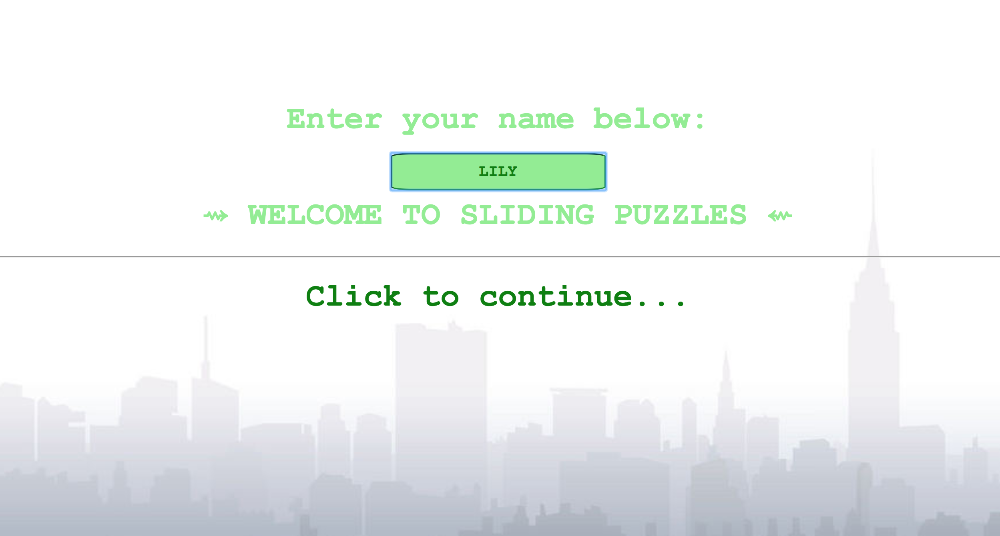
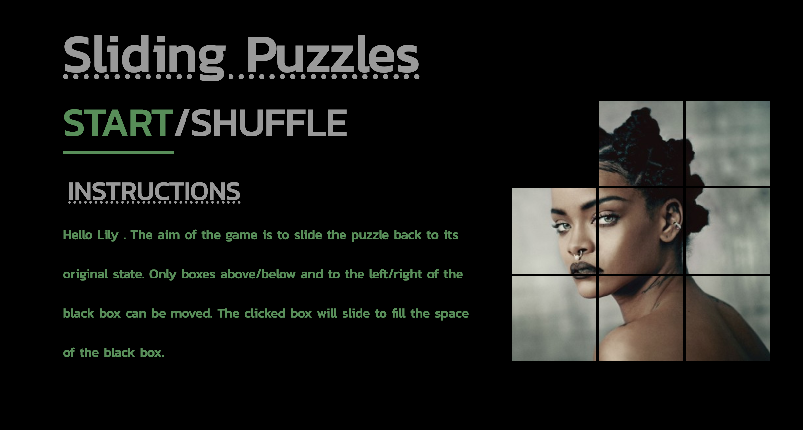
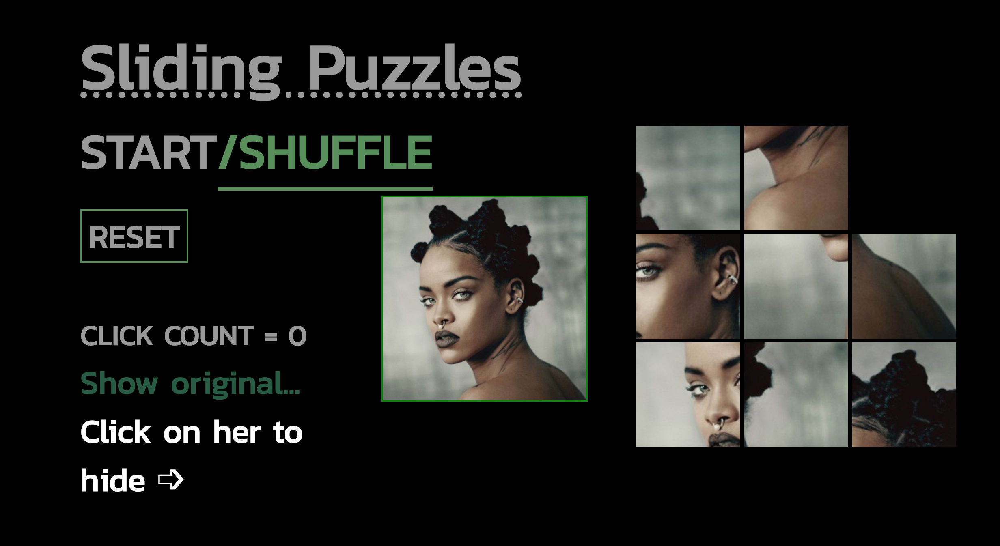
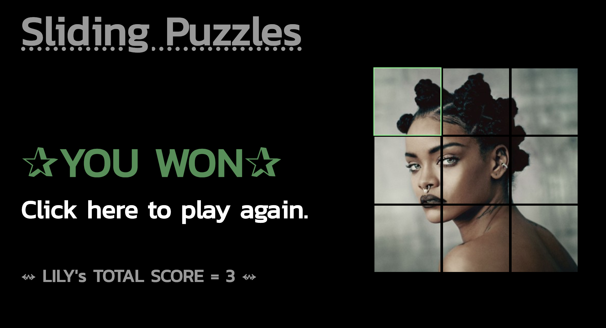

# General Assembly WDI Project 1: Sliding Puzzles

Link to [GitHub Repo](https://github.com/indiaderrick/wdi-project-one/tree/gh-pages)

## Subtitle

Lorem ipsum dolor sit amet, consectetur adipisicing elit, sed do eiusmod tempor incididunt ut labore et dolore magna aliqua. Ut enim ad minim veniam, quis nostrud exercitation ullamco laboris nisi ut aliquip ex ea commodo consequat. Duis aute irure dolor in reprehenderit in voluptate velit esse cillum dolore eu fugiat nulla pariatur. Excepteur sint occaecat cupidatat non proident, sunt in culpa qui officia deserunt mollit anim id est laborum.

• screenshots --> mv (tilda)/desktop/filename.png

• mv (filename).png screenshots/1.png

## Homepage


## Instructions


## In Play



## Winning Screen



## Brief

To create a single-page grid-based game, using HTML, CSS, and JavaScript technologies learnt in the first three weeks of WDI.

## Technologies Used

* HTML5 with HTML5 audio

* CSS3 with animation

* JavaScript (ECMAScript 6)

* Git

* GitHub

* Google Fonts

* Sound Bible


## Featured Piece of Code

inline `function()` like this.

```[javascript]
function(){
  return 'hello world';
}
```

## Styling

I used two Google Fonts:  Courier New for the homepage, and Kanit for all other components of the game.

## Wins and Blockers

Notes: found it hard to translate the logic of a sliding puzzle into JS/ to represent it. Mention that it was hard (for me, but not in theory) to ge the background images to swap based on the text content they contained. Also - indexing how you are going to move the squares was difficult --> use index +1/-1 and +3/-3 but this would mean that when the black square was at index [2]/[5]/[8], it could skip down to the next line (index 0/3/6) & vice versa on the left hand side. Added an if statement so that if this was the case, the function would return and the square would not move.

## Future Features

There are a number of things that I would like to include in this project, given that I had more time to do so:

  * Create a, 4 x 4 puzzle to add complexity to the gameplay.

  * On the homepage, I would like to have had a 'gallery' of photographs from a chosen artist or photographer, and then be able to select which photo (& puzzle complexity) from the list of options.

  * Improve the UX experience, colour scheme and visuals of the game.

  * Make it two player and create a win logic based on the time taken and number of moves of each player.
